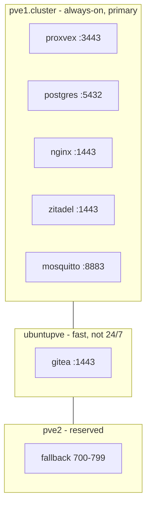
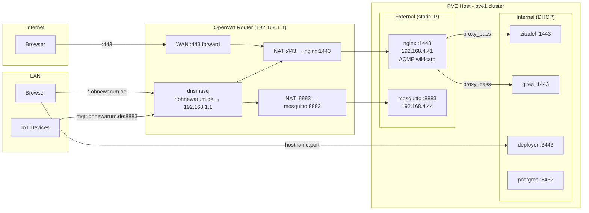
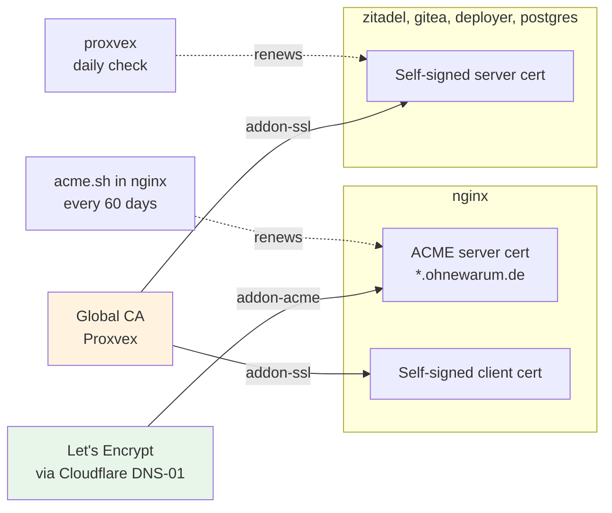
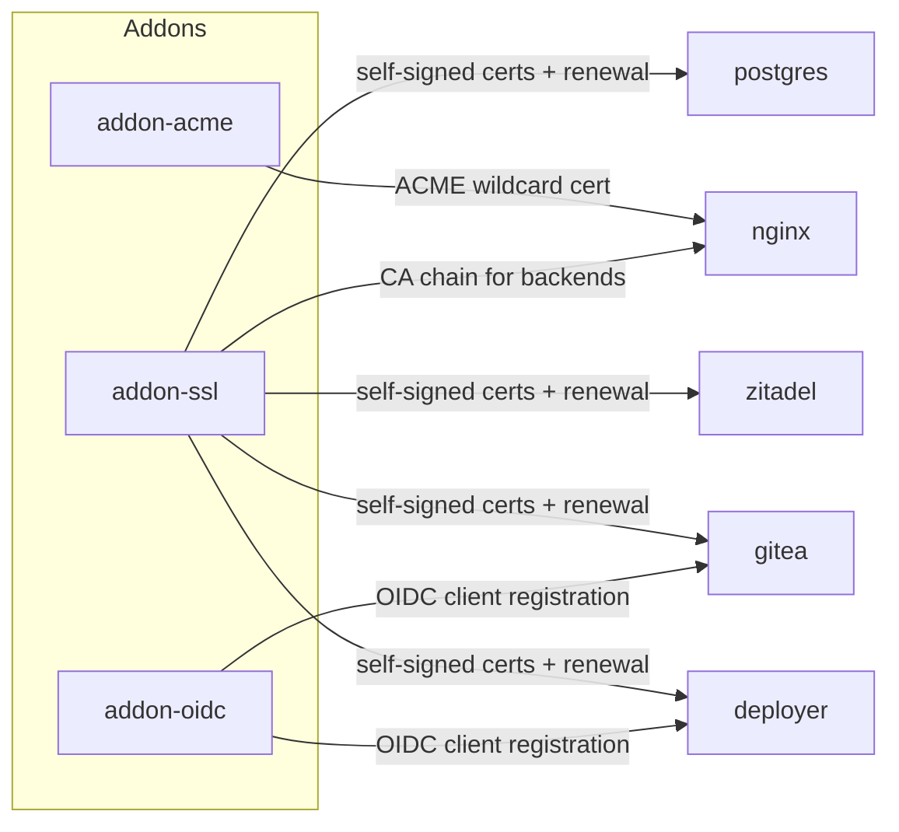

# Production Infrastructure Overview

> Architecture reference for the ohnewarum.de production deployment.
> For step-by-step setup instructions, see [README.md](README.md).

## 1. Cluster Topology



| Node | Role | VMID Range | Always On |
|------|------|------------|-----------|
| **pve1.cluster** | Primary -runs core services | 500-599 | Yes |
| **ubuntupve** | Secondary -runs dev/build workloads | 600-699 | No |
| **pve2** | Fallback for pve1 | 700-799 | No |

All containers are **unprivileged LXC** managed by proxvex. Shared volumes on ZFS (`subvol-999999-proxvex-volumes`).

## 2. Network & Public Access

### IP Strategy

| Type | Apps | IP | DNS Resolution |
|------|------|----|----------------|
| **DHCP** (internal) | deployer, postgres, zitadel, gitea | Automatic | dnsmasq learns hostname via DHCP |
| **Static** (external) | nginx, mosquitto | Fixed | Manual DNS entries in dnsmasq |

Internal apps need no static IPs — dnsmasq on the OpenWrt router resolves their hostnames automatically from DHCP leases. External apps need static IPs because they are NAT targets or must be reachable from outside the subnet.

### Routing Overview



### Hairpin-NAT Avoidance

All public domains (`*.ohnewarum.de`) resolve to `192.168.1.1` — the router's IP on a **different subnet**. Since source (192.168.4.x) and destination (192.168.1.1) are on different segments, DNAT works without hairpin-NAT problems.

```
LAN client (192.168.4.x) → DNS *.ohnewarum.de → 192.168.1.1
  → OpenWrt DNAT :443 → nginx (192.168.4.41):1443
  → nginx proxies to backend (zitadel, gitea, ...)
```

This ensures `https://auth.ohnewarum.de` (port 443) works identically from LAN and WAN — required for OIDC issuer URL consistency.

### HTTPS Port Convention

Rootless LXC containers cannot bind port 443. All proxy-mode apps use **port 1443** for HTTPS (`https_port` default in addon-ssl).

| App | HTTPS Port | Mode |
|-----|-----------|------|
| nginx | :1443 | proxy - ACME SSL proxy |
| zitadel | :1443 | native - Traefik |
| gitea | :1443 | native - Gitea built-in |
| proxvex | :3443 | native - Node.js |
| postgres | :5432 | certs - TLS on app port |
| mosquitto | :8883 | certs - TLS on MQTTS port |

URLs in LAN include the port (e.g. `https://zitadel:1443` for direct access). Public domains are accessible on standard port 443 via NAT redirect through 192.168.1.1.

### DNS (OpenWrt Router - dnsmasq)

| Domain | Resolves To | Flow |
|--------|-------------|------|
| `ohnewarum.de` | 192.168.1.1 | NAT :443 → nginx :1443 → static homepage |
| `auth.ohnewarum.de` | 192.168.1.1 | NAT :443 → nginx :1443 → zitadel :1443 |
| `git.ohnewarum.de` | 192.168.1.1 | NAT :443 → nginx :1443 → gitea :1443 |
| `nebenkosten.ohnewarum.de` | 192.168.1.1 | NAT :443 → nginx :1443 → static frontend |
| `mqtt.ohnewarum.de` | 192.168.1.1 | NAT :8883 → mosquitto :8883 (LAN only) |
| Internal hostnames | DHCP IP | dnsmasq auto-resolves from DHCP leases |

### NAT Rules

| Rule | Source | Port | Destination | Port | Scope |
|------|--------|------|-------------|------|-------|
| HTTPS | 192.168.1.1 | :443 | nginx (192.168.4.41) | :1443 | LAN + WAN |
| MQTTS | 192.168.1.1 | :8883 | mosquitto (192.168.4.44) | :8883 | LAN only |

WAN access requires an additional port forward on the WAN interface (:443 → nginx:1443). MQTTS has no WAN port forward — IoT devices connect only from LAN.

## 3. Certificate Strategy



**How it works:**

- **Nginx** has two certificates: an ACME wildcard (`*.ohnewarum.de`) as server cert for browsers, and a self-signed cert for mTLS/client verification with backend services
- **All other apps** have self-signed server certificates issued by the global CA
- **Nginx → backend**: `proxy_ssl_trusted_certificate chain.pem` validates backend certs
- **LAN browsers** must trust the global self-signed CA certificate. One-time install on 2 devices (Mac + iPad)

| | Server Cert | Issued By | Addon | Renewal |
|---|---|---|---|---|
| **nginx** | `*.ohnewarum.de` | Let's Encrypt | `addon-acme` | acme.sh (60 days) |
| **zitadel** | `zitadel.local` | Global CA | `addon-ssl` | deployer (daily) |
| **gitea** | `gitea.local` | Global CA | `addon-ssl` | deployer (daily) |
| **deployer** | `proxvex.local` | Global CA | `addon-ssl` | deployer (daily) |
| **postgres** | `postgres.local` | Global CA | `addon-ssl` | deployer (daily) |

## 4. OIDC Authentication

| App | OIDC | Issuer URL |
|-----|------|-----------|
| proxvex | `addon-oidc` | `https://auth.ohnewarum.de` |
| Gitea | `addon-oidc` | `https://auth.ohnewarum.de` |
| Nebenkosten | Client-side PKCE | `https://auth.ohnewarum.de` |
| Homepage | None (public) | — |

- **Zitadel** is the OIDC provider, running with `ZITADEL_EXTERNALDOMAIN=auth.ohnewarum.de` and `ZITADEL_EXTERNALPORT=443`
- **Server-to-server** calls (token exchange, OIDC setup) go directly to `https://zitadel:1443`, bypassing Nginx
- **Browser redirects** go to `https://auth.ohnewarum.de` (port 443 — resolved to 192.168.1.1 by dnsmasq, NAT to nginx:1443, proxied to zitadel)

## 5. Addons & Stack System

Cross-cutting concerns (HTTPS, authentication) are managed through **addons**, and shared credentials/connection info through **stacks**.

### Addons



| Addon | What it does |
|-------|-------------|
| **addon-ssl** | Generates self-signed server certs from global CA, configures TLS, auto-renewal via deployer (daily) |
| **addon-acme** | Obtains Let's Encrypt wildcard cert via Cloudflare DNS-01, auto-renewal via acme.sh (60 days) |
| **addon-oidc** | Registers OIDC client in Zitadel, configures app for SSO |

Addons are selected per app at install/reconfigure time via `selectedAddons: ["addon-ssl", "addon-oidc"]`.

### Stacks

Stacks are shared credential stores that connect providers and consumers within an environment:

```
Stack "production" (stacktype: postgres + oidc + cloudflare)
├── entries (secrets):     POSTGRES_PASSWORD, ZITADEL_DB_PASSWORD, CF_TOKEN, ...
└── provides (connection): ZITADEL_URL, ZITADEL_PORT, POSTGRES_PORT, ...
```

- **Providers** (postgres, zitadel) publish connection info to the stack after deployment
- **Consumers** read it automatically via template variables (`{{ ZITADEL_URL }}`)
- When a provider is reconfigured (e.g. SSL added), its provides update — consumers may need reconfiguration

## 6. Installation & Configuration

### proxvex

The management platform that deploys and configures all LXC containers. Runs on `pve1.cluster` as an unprivileged Alpine container.

- **UI**: `https://proxvex:3443` (LAN only)
- **Deploy**: `./production/deploy.sh <app|all>` (runs from PVE host or dev machine)
- **Config**: Shared volumes at `/rpool/data/subvol-999999-proxvex-volumes/`

### Nginx

Nginx serves as both **static host** and **reverse proxy**:

```
/etc/nginx/conf.d/          ← Volume mount (persisted)
├── default.conf            ← Reject unknown domains (444)
├── ohnewarum.conf          ← Static homepage
├── nebenkosten.conf        ← Frontend SPA (try_files)
├── auth.conf               ← Reverse proxy → zitadel:1443
└── git.conf                ← Reverse proxy → gitea:1443
```

Rootless (uid 101), listens on port 8080 (HTTP) and 1443 (HTTPS via ACME wildcard cert). WAN access via OpenWrt port forward `:443 → :1443`. Managed by `setup-nginx.sh`.

---

*For detailed setup instructions, see [README.md](README.md).*
*For the Proxmox snapshot bug report, see [docs/pve-snapshot-bind-mount-bug.md](../docs/pve-snapshot-bind-mount-bug.md).*
