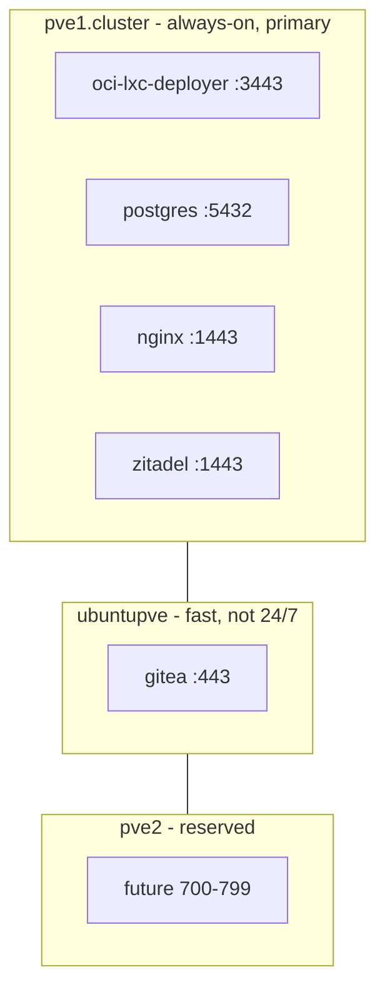
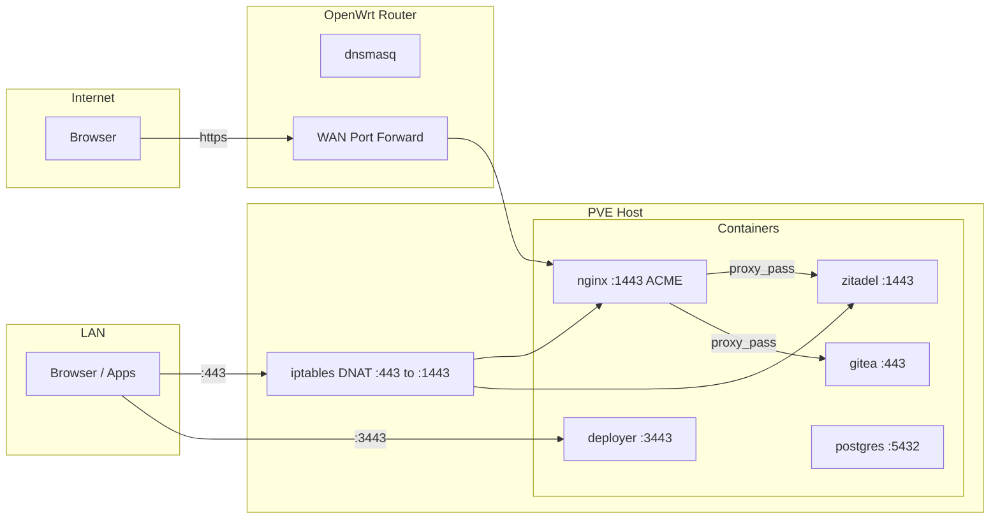
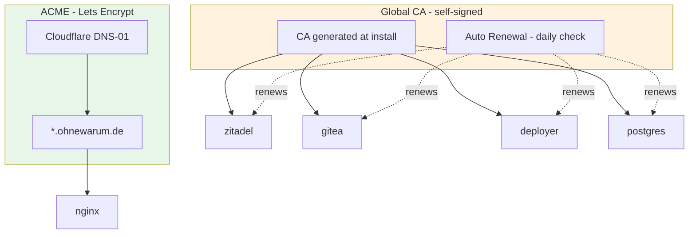
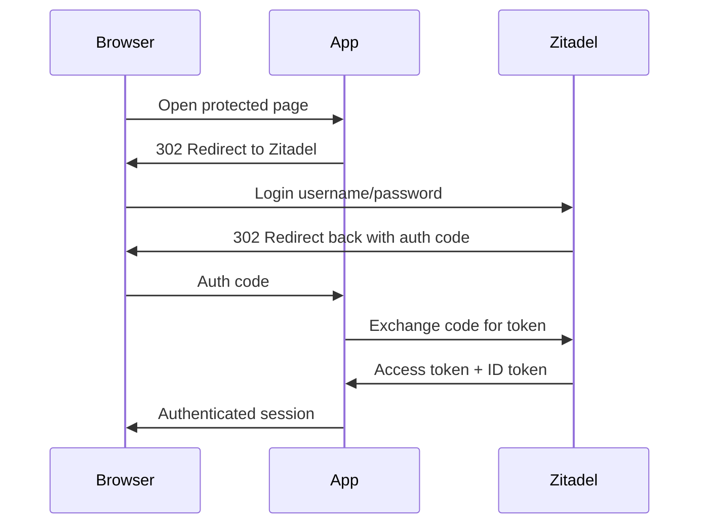

# Production Infrastructure Overview

> Architecture reference for the ohnewarum.de production deployment.
> For step-by-step setup instructions, see [README.md](README.md).

## 1. Cluster Topology



| Node | Role | VMID Range | Always On |
|------|------|------------|-----------|
| **pve1.cluster** | Primary -runs core services | 500-599 | Yes |
| **ubuntupve** | Secondary -runs dev/build workloads | 600-699 | No |
| **pve2** | Reserved for future expansion | 700-799 | -|

All containers are **unprivileged LXC** managed by oci-lxc-deployer. Shared volumes on ZFS (`subvol-999999-oci-lxc-deployer-volumes`).

## 2. Network & Public Access



### HTTPS Port Convention

Rootless LXC containers cannot bind port 443. All proxy-mode apps use **port 1443** for HTTPS (`https_port` default in addon-ssl).

| App | HTTPS Port | Mode |
|-----|-----------|------|
| nginx | :1443 | proxy - ACME SSL proxy |
| zitadel | :1443 | native - Traefik |
| gitea | :1443 | proxy |
| oci-lxc-deployer | :3443 | native - Node.js |
| postgres | :5432 | certs - TLS on app port |

URLs in LAN include the port: `https://auth.ohnewarum.de:1443`

### DNS (OpenWrt Router - dnsmasq)

| Domain | Resolves To | Flow |
|--------|-------------|------|
| `ohnewarum.de` | nginx IP | Direct to nginx |
| `auth.ohnewarum.de` | nginx IP | PVE DNAT :443 to :1443, nginx proxies to zitadel |
| `git.ohnewarum.de` | nginx IP | PVE DNAT :443 to :1443, nginx proxies to gitea |
| `nebenkosten.ohnewarum.de` | nginx IP | PVE DNAT :443 to :1443, static frontend |
| `postgres`, `zitadel`, ... | Container IPs | Internal, no DNAT needed |

## 3. Certificate Strategy



| Cert Type | Where | Addon | Renewal |
|-----------|-------|-------|---------|
| **ACME Wildcard** | Nginx only | `addon-acme` | Automatic (acme.sh, 60 days) |
| **Self-signed** | All other apps | `addon-ssl` | Automatic (deployer, daily check) |

**LAN browsers** must trust the global CA (installed once on 2 devices).
Nginx trusts backend certs via `proxy_ssl_trusted_certificate chain.pem`.

## 4. OIDC Authentication



| App | OIDC | Flow | Issuer URL |
|-----|------|------|-----------|
| oci-lxc-deployer | `addon-oidc` | Authorization Code | `https://auth.ohnewarum.de` |
| Gitea | `addon-oidc` | Authorization Code | `https://auth.ohnewarum.de` |
| Nebenkosten | Client-side | PKCE (no secret) | `https://auth.ohnewarum.de` |
| Homepage | None | Public | -|

Server-to-server calls (token exchange, OIDC setup) go directly to `https://zitadel:1443` with a `Host: auth.ohnewarum.de` header. This avoids routing through Nginx for internal traffic.

## 5. Installation & Configuration

### oci-lxc-deployer

The management platform that deploys and configures all LXC containers. Runs on `pve1.cluster` as an unprivileged Alpine container.

- **UI**: `https://oci-lxc-deployer:3443` (LAN only)
- **Deploy**: `./production/deploy.sh <app|all>` (runs from PVE host or dev machine)
- **Config**: Shared volumes at `/rpool/data/subvol-999999-oci-lxc-deployer-volumes/`

### Nginx Configuration

Nginx serves as both **static host** and **reverse proxy**. Configuration via bind-mounted volume:

```
/etc/nginx/conf.d/          ← Volume mount (persisted)
├── default.conf            ← Reject unknown domains (444)
├── ohnewarum.conf          ← Static homepage
├── nebenkosten.conf        ← Frontend SPA (try_files)
├── auth.conf               ← Reverse proxy → zitadel:1443
└── git.conf                ← Reverse proxy → gitea:443
```

Managed by `setup-nginx.sh`. Nginx is rootless (uid 101), listens on port 8080. The ACME addon provides an SSL proxy on port 8443 (mapped to 443 via PVE DNAT).

### Stack System

Secrets and connection info are managed through **stacks** -shared credential stores per environment:

```
Stack "production" (stacktype: postgres + oidc + cloudflare)
├── entries (secrets):     POSTGRES_PASSWORD, ZITADEL_DB_PASSWORD, CF_TOKEN, ...
└── provides (connection): ZITADEL_URL, ZITADEL_PORT, POSTGRES_PORT, ...
```

Providers (postgres, zitadel) publish their connection info to the stack. Consumers read it automatically via template variables (`{{ ZITADEL_URL }}`).

---

*For detailed setup instructions, see [README.md](README.md).*
*For the Proxmox snapshot bug report, see [docs/pve-snapshot-bind-mount-bug.md](../docs/pve-snapshot-bind-mount-bug.md).*
